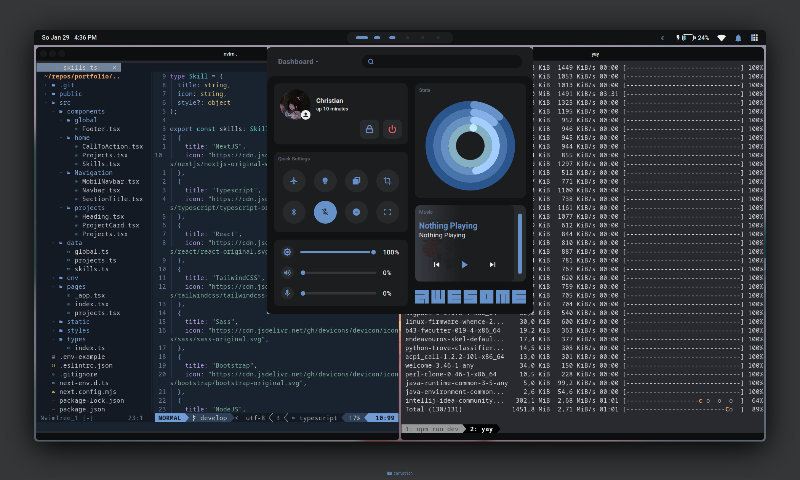
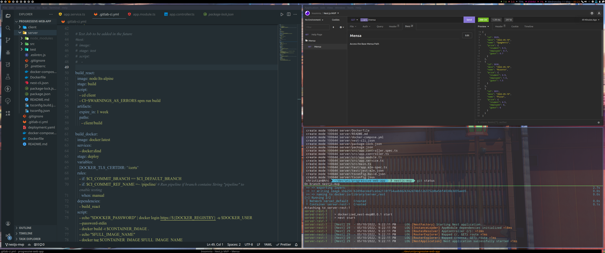

# Outdated
Switched to [Hyprland](https://github.com/Blankjr/hyrland-dots)  
If you look for my old nixos config: [nixos](https://github.com/Blankjr/nixdots)

# Dotfiles

## Main Components

- Window Manager: Awesomewm
- Compositor: Picom
- Launcher: Rofi
- Terminal: Kitty
  - Font: JetBrains Mono Nerd Font
  - Theme: XCodeDark (with custom cursor)
- OS: Arch Linux
- Code Editor: Neovim ~~& VSCodium~~
    - Theme: Tokyo Night

## Other Applications

- Document Viewer: Zathura
- Browser
  - Librewolf
    - Theme: beautifulFire anime
  - Firefox Developer Edition
    - Theme: Catppuccin-dark-peach
  - Chromium
- File Manager
  - lf & Thunar
- Rest Client: Insomnia

## Globals
- GTK2/3 :
  - Arc-Dark
  - Icons: Sardi Arc
  - Mouse Cursor: Bibata-Modern-Ice
  
  

<samp><b>Archived</b></samp>

<h2> Screenshot (Old)</h2>

 
